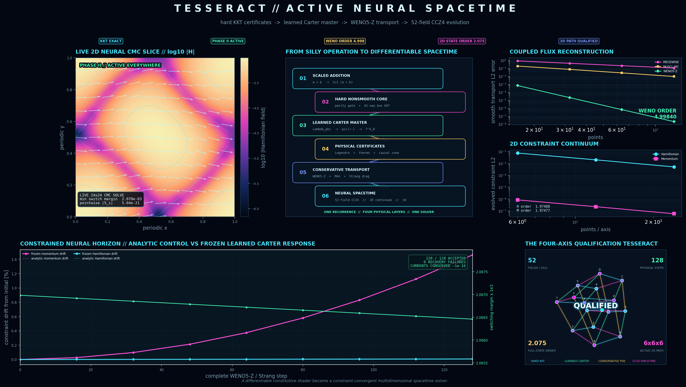
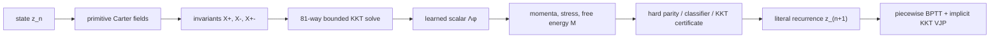

# Carter–KKT Tesseract

**A hard-constrained, differentiable Vulkan simulator that grew out of the
operation \(a \oplus b=\tfrac32(a+b)\).**



The project combines a parity-gated scalar recurrence, an exact 81-candidate
box-KKT solve, Carter-style multifluid constitutive structure, a learned scalar
master function \(\Lambda_\phi\), reverse-mode differentiation through time,
intrinsic Lyapunov conditioning, and a standalone coupled
CCZ4/GRHD/two-current numerical-relativity PDE backend.

The conditioned literal map has been validated for **128 undamped Vulkan
steps** with:

| Property | Measured result |
|---|---:|
| Integration scale | `1.0` |
| Active and opposite KKT certificates | valid at every step |
| Minimum KKT feasibility margin | `0.0375403` |
| Minimum classifier margin | `0.0267592` |
| Minimum parity-boundary distance | `0.125` |
| Maximum Lyapunov increment | `0.0` |
| Attractor | `z* = 0.1019493853` |
| Intrinsic attractor gain | `0.683772234` |

No continuation, state clamp, damping, or gain backtracking is active in that
test.

## From one silly operation to this

The entire construction retains the DNA of

\[
a\oplus b=\frac32(a+b).
\]

It became the primitive

\[
u_n=\frac32(z_n+c_n),
\]

then gained a parity gate, normalization, a constrained correction, Carter
invariants and momenta, a free-energy objective, hard switching certificates,
a learned master function, differentiable KKT pullbacks, and finally a
Lyapunov-conditioned attractor.

The complete six-stage derivation is in
[docs/ORIGIN_STORY.md](docs/ORIGIN_STORY.md).

## What is implemented



- Exact Carter invariants, momenta, generalized pressure, stress, and
  free-energy closure.
- Exhaustive \(3^4=81\) active-set enumeration for a four-variable box QP.
- Hard parity, branch, classifier, and boundary-crossing decisions.
- A neural \(\Lambda_\phi(X_+,X_-,X_{+-},\Gamma,q)\) whose derivatives generate
  the constitutive response.
- A custom selected-system KKT tangent and transpose VJP.
- Native Slang/Vulkan forward execution and mixed-direction neural VJP.
- Progressive residual-flow continuation for diagnosing the original
  explosive map.
- A separate intrinsically conditioned model that runs the literal scale-1
  map for 128+ steps.
- A self-contained Theory 3.3 mode with future-timelike currents, an analytic
  M1 master, physical admissibility gates, and a differentiated
  characteristic audit.
- A full-stack neural-spacetime observatory plus the original interactive
  Vulkan phase-space and tesseract instrument.

## Quick start

The project currently targets Windows PowerShell with a Vulkan-capable GPU.

### Interactive visualization

```powershell
.\run_visualization.ps1
```

The default view rebuilds a live qualified 24x24 frozen-neural CMC slice and
connects it to the tracked WENO, continuum, 128-step horizon, and 3D
qualification evidence. Use `-Fast` to render directly from the recorded
artifact without rebuilding the slice.

Open the original interactive Vulkan recurrence microscope with:

```powershell
.\run_visualization.ps1 -Mode literal
```

That view can switch between the explosive baseline and conditioned model,
scrub recurrence time, animate the projected tesseract, and save a snapshot.

### Conditioned literal recurrence

```powershell
.\run_conditioned_literal.ps1
```

This compiles the conditioned Slang module and runs horizons
`1, 4, 16, 64, 128` at integration scale `1.0`.

### Theory 3.3 physical hybrid

```powershell
.\run_theory33_hybrid.ps1
```

This runs the standalone physical two-current mode for 128 literal steps and
audits every evolved state for KKT validity, timelike currents, convexity, and
causal characteristic speeds. It also qualifies a 1,025-state initialization
grid over `[-1, 1]` using the fitted state-dependent odd-cell capture gain,
then tests the global absorbing gate through signed magnitude `1e300`.
See
[docs/THEORY33_HYBRID.md](docs/THEORY33_HYBRID.md).

Validate the analytic M1 closure and its native Vulkan reverse pass with:

```powershell
.\run_theory33_slang.ps1
```

Run the ordered nonsmooth and neural-constitutive experiment ladder with:

```powershell
.\run_theory33_experiments.ps1 `
    -Output .\theory33_experiment_results.json
```

This tests a certified neural capture controller, a jump-aware boundary VJP,
a convex neural dissipation potential, a partially convex Carter master
residual, and an explicit two-phase master. See the
[complete experiment report](THEORY33_EXPERIMENT_REPORT.md).

Run the advanced frozen-constitutive qualification pipeline with:

```powershell
.\run_theory33_advanced.ps1
```

This generates independent kinetic EOS/transport tables, trains a covariant
PSD mobility and uncertainty-aware phase edge, compares four multi-step BPTT
estimators, continues the Carter residual under explicit physical margins,
and serializes the qualified result for no-fit replay. Export and validate
that frozen result on Vulkan with:

```powershell
.\run_theory33_frozen_slang.ps1
```

See the
[advanced qualification report](THEORY33_ADVANCED_REPORT.md).

### Numerical-relativity PDE solver

Run the standalone float64 coupled Theory 3.3 reference backend with:

```powershell
.\run_tesseract_nr.ps1 -Points 16 -Steps 4 -Dt 1e-5
```

It evolves 52 scalar components per cell across CCZ4 geometry and gauge,
conservative relativistic matter, Carter baryon/carrier currents, and mixed
massive-vector fields. The runner reports conservation, recovery, entropy,
Gauss, convexity, and spacetime-constraint diagnostics. See
[the NR PDE solver guide](docs/NR_PDE_SOLVER.md).
The source boundary, state contract, validation evidence, and remaining
promotion gates are recorded in the
[NR PDE transplant report](NR_PDE_TRANSPLANT_REPORT.md).

The qualified frozen invariant gradient can now drive both multifluid
primitive recovery and the complete coupled RHS:

```powershell
.\run_tesseract_nr.ps1 `
    -Points 8 `
    -Steps 1 `
    -Dt 1e-5 `
    -Constitutive frozen
```

Compare the active learned phase against the analytic M1 control on a nested
resolution ladder with:

```powershell
.\run_tesseract_nr_convergence.ps1 `
    -Resolutions 8,16,32 `
    -FinalTime 1e-5 `
    -Output tesseract_nr_convergence_results.json
```

The recorded 8/16/32 ladder passes recovery, conservation, entropy,
switching, Legendre, thermodynamic, hyperbolicity, causality, and
self-convergence gates. Its scope and measurements are in the
[neural PDE promotion report](NEURAL_PDE_PROMOTION_REPORT.md).

Construct and evolve resolution-matched active-neural CMC spacetimes with:

```powershell
.\run_tesseract_nr_constrained.ps1 `
    -Resolutions 8,16,32 `
    -FinalTime 1e-6 `
    -Output tesseract_nr_constrained_results.json
```

The recorded constrained ladder uses 10/20/40 complete steps and obtains
approximately second-order convergence of the Hamiltonian constraint,
momentum constraint, evolved state, and geometric-work energy rate. See the
[constrained neural spacetime report](CONSTRAINED_NEURAL_SPACETIME_REPORT.md).

Run the high-order, long-horizon, multidimensional frontier campaign with:

```powershell
.\run_tesseract_nr_frontier.ps1 `
    -HorizonSteps 128 `
    -Output tesseract_nr_frontier_results.json
```

The recorded campaign qualifies fifth-order WENO5-Z reconstruction, a
128-step constrained analytic/frozen horizon, second-order 2D CCZ4 and
complete-state convergence on 6x6/12x12/24x24 grids, and the complete 6x6x6
neural-spacetime path. See the
[neural spacetime frontier report](NEURAL_SPACETIME_FRONTIER_REPORT.md).

Run the characteristic-shock and hard-phase-boundary campaign with:

```powershell
.\run_tesseract_nr_shocks.ps1
```

The tracked 2D campaign exposes density-floor violations in the unlimited
control, preserves both material and carrier floors with conservative local
face limiting, forces 64 recovery branch updates, and evolves three cells
through the learned hard phase threshold with all physical recovery gates
intact. See the
[characteristic shock frontier report](CHARACTERISTIC_SHOCK_FRONTIER_REPORT.md).

### Retrain the conditioned model

```powershell
.\run_train_conditioned.ps1
```

Training uses the literal map, a one-step capture phase, a
`4 → 8 → 16 → 32` horizon curriculum, switching-margin penalties, and

\[
V(z)=(z-z_\*)^2,\qquad
\max\!\left(0,V(z_{n+1})-0.9V(z_n)\right).
\]

### Full Vulkan reverse validation

```powershell
.\run_full_slang.ps1
```

### Original GLSL compute shader

```powershell
.\run.ps1
```

## Reproduce the whole progression

Original undamped failure at step four:

```powershell
.\run_progressive_full.ps1 `
    -Horizons '1,2,3,4' `
    -IntegrationScale 1.0 `
    -MaxLocalGain 0
```

Adaptive full-physics continuation through deep horizons:

```powershell
.\run_progressive_full.ps1 `
    -Horizons '1,2,4,8,16,32,64,128'
```

Literal conditioned result:

```powershell
.\run_conditioned_literal.ps1
```

For the exact environment and validation sequence, see
[docs/REPRODUCIBILITY.md](docs/REPRODUCIBILITY.md).

## Repository guide

| Path | Purpose |
|---|---|
| `carter_tesseract_kkt.comp` | Canonical GLSL full-physics compute shader |
| `hybrid_tesseract.py` | Differentiable PyTorch reference and implicit KKT VJP |
| `theory33_hybrid.py` | Physical two-current M1 mode and characteristic audit |
| `theory33_hybrid.slang` | Native Vulkan M1 constitutive and reverse kernel |
| `fit_theory33_basin.py` | Deterministic odd-cell gain fitting and verification |
| `run_theory33_hybrid.py` | Literal physical-mode validation entrypoint |
| `theory33_experiments.py` | Nonsmooth and neural-constitutive experiment ladder |
| `theory33_kinetic_data.py` | Independent relativistic kinetic EOS/transport generator |
| `theory33_advanced.py` | Frozen replay, PSD mobility, event BPTT, and margin continuation |
| `theory33_frozen_variants.json` | Qualified replayable constitutive weights and evidence |
| `theory33_qualified_frozen.slang` | Generated qualified frozen Vulkan module |
| `tesseract_nr/` | Standalone CCZ4 + Theory 3.3 numerical-relativity backend |
| `run_tesseract_nr.py` | Coupled NR smoke and checkpoint runner |
| `run_tesseract_nr.ps1` | PowerShell entrypoint for the NR backend |
| `run_tesseract_nr_convergence.py` | Analytic/frozen nested-grid study |
| `tesseract_nr_convergence_results.json` | Recorded active-neural ladder |
| `run_tesseract_nr_constrained.py` | Constraint-converged neural spacetime ladder |
| `tesseract_nr_constrained_results.json` | Recorded CMC/CCZ4 convergence evidence |
| `run_tesseract_nr_frontier.py` | WENO, long-horizon, 2D/3D qualification campaign |
| `tesseract_nr_frontier_results.json` | Recorded multidimensional frontier evidence |
| `run_tesseract_nr_shocks.py` | Characteristic shocks, positivity, and phase-crossing campaign |
| `tesseract_nr_shock_results.json` | Recorded shock-frontier evidence |
| `migrate_full_slang.py` | Deterministic GLSL-to-Slang migration and native kernels |
| `progressive_full_unroll.py` | Piecewise BPTT, continuation, margins, and validation |
| `train_lyapunov_conditioned.py` | Intrinsic attractor and Lyapunov curriculum |
| `visualize_tesseract.py` | Full-stack and Vulkan literal visualization entrypoint |
| `tesseract_full_stack_visualizer.py` | Qualified neural-spacetime dashboard renderer |
| `tesseract_full_stack_dashboard.png` | README full-stack qualification dashboard |
| `hybrid_model*.json` | Portable model weights, dynamics, and audit metadata |
| `carter_tesseract*.slang` | Generated baseline and conditioned Slang modules |
| `test_*.py` | PyTorch, Slang AD, recurrence, and backend validation |
| `docs/` | Derivation, mathematics, architecture, AD, and reproduction guide |

Generated `.pt` checkpoints, SPIR-V binaries, virtual environments, and
downloaded compiler tools are intentionally ignored. The portable JSON model
artifacts contain everything needed to regenerate the tracked Slang modules.

## Documentation

- [Project evolution](docs/ORIGIN_STORY.md)
- [Mathematical model](docs/MATHEMATICAL_MODEL.md)
- [System architecture](docs/ARCHITECTURE.md)
- [Differentiation and hard decisions](docs/DIFFERENTIATION.md)
- [Theory 3.3 physical hybrid mode](docs/THEORY33_HYBRID.md)
- [Theory 3.3 experiment report](THEORY33_EXPERIMENT_REPORT.md)
- [Advanced frozen-constitutive report](THEORY33_ADVANCED_REPORT.md)
- [Frozen neural PDE promotion report](NEURAL_PDE_PROMOTION_REPORT.md)
- [Constraint-converged neural spacetime report](CONSTRAINED_NEURAL_SPACETIME_REPORT.md)
- [Neural spacetime frontier report](NEURAL_SPACETIME_FRONTIER_REPORT.md)
- [Characteristic shock frontier report](CHARACTERISTIC_SHOCK_FRONTIER_REPORT.md)
- [Lyapunov conditioning](docs/LYAPUNOV_CONDITIONING.md)
- [Visualization instrument](docs/VISUALIZATION.md)
- [Reproducibility and validation](docs/REPRODUCIBILITY.md)
- [GitHub publishing guide](docs/PUBLISHING.md)
- [Progressive unroll measurements](FULL_PHYSICS_UNROLL_REPORT.md)
- [Literal conditioning measurements](LYAPUNOV_CONDITIONING_REPORT.md)

## Current limitations

- The validated basin is empirical, not a global stability proof.
- The initial capture can be locally expansive while remaining
  Lyapunov-decreasing on the tested basin.
- Hard switching surfaces are genuinely nonsmooth. Derivatives are
  branchwise and are rejected or marked low-confidence near a switch.
- A Slang SPIR-V reverse-emission issue affects the nested dual-valued
  physical closure. The production diagnostic uses a validated analytical
  neural VJP plus small centered Vulkan Jacobians inside a frozen hard region.
- GPU validation currently requires local Vulkan hardware; hosted CI performs
  source, artifact, and deterministic-generation checks only.

## Contributing

See [CONTRIBUTING.md](CONTRIBUTING.md). Please preserve the separation between
hard decisions and continuous differentiation, and include finite-difference
evidence for derivative changes.

## Citation

If you use Carter/KKT Tesseract in research, please cite the project using the
machine-readable metadata in [CITATION.cff](CITATION.cff). GitHub exposes this
metadata through its **Cite this repository** interface.

## License

Carter/KKT Tesseract is licensed under the
[Apache License 2.0](LICENSE). Attribution information is provided in
[NOTICE](NOTICE).
