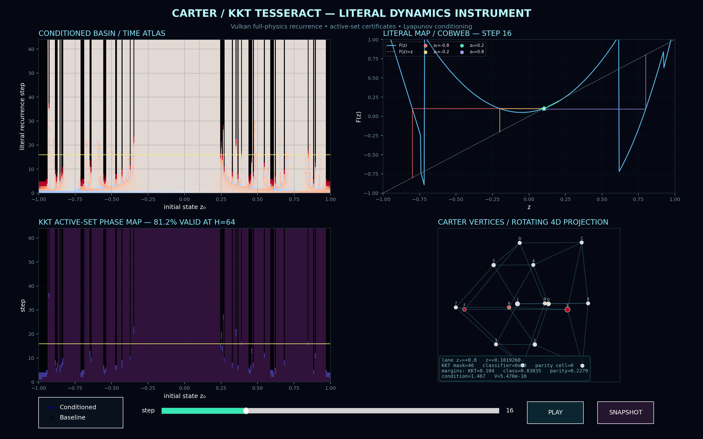
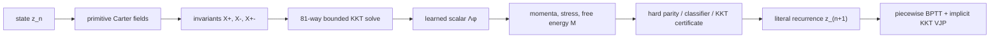

# Carter–KKT Tesseract

**A hard-constrained, differentiable Vulkan simulator that grew out of the
operation \(a \oplus b=\tfrac32(a+b)\).**



The project combines a parity-gated scalar recurrence, an exact 81-candidate
box-KKT solve, Carter-style multifluid constitutive structure, a learned scalar
master function \(\Lambda_\phi\), reverse-mode differentiation through time,
and intrinsic Lyapunov conditioning.

The conditioned literal map has been validated for **128 undamped Vulkan
steps** with:

| Property | Measured result |
|---|---:|
| Integration scale | `1.0` |
| Active and opposite KKT certificates | valid at every step |
| Minimum KKT feasibility margin | `0.0375403` |
| Minimum classifier margin | `0.0267592` |
| Minimum parity-boundary distance | `0.125` |
| Maximum Lyapunov increment | `0.0` |
| Attractor | `z* = 0.1019493853` |
| Intrinsic attractor gain | `0.683772234` |

No continuation, state clamp, damping, or gain backtracking is active in that
test.

## From one silly operation to this

The entire construction retains the DNA of

\[
a\oplus b=\frac32(a+b).
\]

It became the primitive

\[
u_n=\frac32(z_n+c_n),
\]

then gained a parity gate, normalization, a constrained correction, Carter
invariants and momenta, a free-energy objective, hard switching certificates,
a learned master function, differentiable KKT pullbacks, and finally a
Lyapunov-conditioned attractor.

The complete six-stage derivation is in
[docs/ORIGIN_STORY.md](docs/ORIGIN_STORY.md).

## What is implemented



- Exact Carter invariants, momenta, generalized pressure, stress, and
  free-energy closure.
- Exhaustive \(3^4=81\) active-set enumeration for a four-variable box QP.
- Hard parity, branch, classifier, and boundary-crossing decisions.
- A neural \(\Lambda_\phi(X_+,X_-,X_{+-},\Gamma,q)\) whose derivatives generate
  the constitutive response.
- A custom selected-system KKT tangent and transpose VJP.
- Native Slang/Vulkan forward execution and mixed-direction neural VJP.
- Progressive residual-flow continuation for diagnosing the original
  explosive map.
- A separate intrinsically conditioned model that runs the literal scale-1
  map for 128+ steps.
- A self-contained Theory 3.3 mode with future-timelike currents, an analytic
  M1 master, physical admissibility gates, and a differentiated
  characteristic audit.
- A four-panel Vulkan-backed phase-space and tesseract visualization.

## Quick start

The project currently targets Windows PowerShell with a Vulkan-capable GPU.

### Interactive visualization

```powershell
.\run_visualization.ps1
```

Use the controls to switch between the explosive baseline and conditioned
model, scrub recurrence time, animate the projected tesseract, and save a
snapshot.

### Conditioned literal recurrence

```powershell
.\run_conditioned_literal.ps1
```

This compiles the conditioned Slang module and runs horizons
`1, 4, 16, 64, 128` at integration scale `1.0`.

### Theory 3.3 physical hybrid

```powershell
.\run_theory33_hybrid.ps1
```

This runs the standalone physical two-current mode for 128 literal steps and
audits every evolved state for KKT validity, timelike currents, convexity, and
causal characteristic speeds. It also qualifies a 1,025-state initialization
grid over `[-1, 1]` using the fitted state-dependent odd-cell capture gain,
then tests the global absorbing gate through signed magnitude `1e300`.
See
[docs/THEORY33_HYBRID.md](docs/THEORY33_HYBRID.md).

Validate the analytic M1 closure and its native Vulkan reverse pass with:

```powershell
.\run_theory33_slang.ps1
```

### Retrain the conditioned model

```powershell
.\run_train_conditioned.ps1
```

Training uses the literal map, a one-step capture phase, a
`4 → 8 → 16 → 32` horizon curriculum, switching-margin penalties, and

\[
V(z)=(z-z_\*)^2,\qquad
\max\!\left(0,V(z_{n+1})-0.9V(z_n)\right).
\]

### Full Vulkan reverse validation

```powershell
.\run_full_slang.ps1
```

### Original GLSL compute shader

```powershell
.\run.ps1
```

## Reproduce the whole progression

Original undamped failure at step four:

```powershell
.\run_progressive_full.ps1 `
    -Horizons '1,2,3,4' `
    -IntegrationScale 1.0 `
    -MaxLocalGain 0
```

Adaptive full-physics continuation through deep horizons:

```powershell
.\run_progressive_full.ps1 `
    -Horizons '1,2,4,8,16,32,64,128'
```

Literal conditioned result:

```powershell
.\run_conditioned_literal.ps1
```

For the exact environment and validation sequence, see
[docs/REPRODUCIBILITY.md](docs/REPRODUCIBILITY.md).

## Repository guide

| Path | Purpose |
|---|---|
| `carter_tesseract_kkt.comp` | Canonical GLSL full-physics compute shader |
| `hybrid_tesseract.py` | Differentiable PyTorch reference and implicit KKT VJP |
| `theory33_hybrid.py` | Physical two-current M1 mode and characteristic audit |
| `theory33_hybrid.slang` | Native Vulkan M1 constitutive and reverse kernel |
| `fit_theory33_basin.py` | Deterministic odd-cell gain fitting and verification |
| `run_theory33_hybrid.py` | Literal physical-mode validation entrypoint |
| `migrate_full_slang.py` | Deterministic GLSL-to-Slang migration and native kernels |
| `progressive_full_unroll.py` | Piecewise BPTT, continuation, margins, and validation |
| `train_lyapunov_conditioned.py` | Intrinsic attractor and Lyapunov curriculum |
| `visualize_tesseract.py` | Vulkan-backed interactive dynamics instrument |
| `hybrid_model*.json` | Portable model weights, dynamics, and audit metadata |
| `carter_tesseract*.slang` | Generated baseline and conditioned Slang modules |
| `test_*.py` | PyTorch, Slang AD, recurrence, and backend validation |
| `docs/` | Derivation, mathematics, architecture, AD, and reproduction guide |

Generated `.pt` checkpoints, SPIR-V binaries, virtual environments, and
downloaded compiler tools are intentionally ignored. The portable JSON model
artifacts contain everything needed to regenerate the tracked Slang modules.

## Documentation

- [Project evolution](docs/ORIGIN_STORY.md)
- [Mathematical model](docs/MATHEMATICAL_MODEL.md)
- [System architecture](docs/ARCHITECTURE.md)
- [Differentiation and hard decisions](docs/DIFFERENTIATION.md)
- [Theory 3.3 physical hybrid mode](docs/THEORY33_HYBRID.md)
- [Lyapunov conditioning](docs/LYAPUNOV_CONDITIONING.md)
- [Visualization instrument](docs/VISUALIZATION.md)
- [Reproducibility and validation](docs/REPRODUCIBILITY.md)
- [GitHub publishing guide](docs/PUBLISHING.md)
- [Progressive unroll measurements](FULL_PHYSICS_UNROLL_REPORT.md)
- [Literal conditioning measurements](LYAPUNOV_CONDITIONING_REPORT.md)

## Current limitations

- The validated basin is empirical, not a global stability proof.
- The initial capture can be locally expansive while remaining
  Lyapunov-decreasing on the tested basin.
- Hard switching surfaces are genuinely nonsmooth. Derivatives are
  branchwise and are rejected or marked low-confidence near a switch.
- A Slang SPIR-V reverse-emission issue affects the nested dual-valued
  physical closure. The production diagnostic uses a validated analytical
  neural VJP plus small centered Vulkan Jacobians inside a frozen hard region.
- GPU validation currently requires local Vulkan hardware; hosted CI performs
  source, artifact, and deterministic-generation checks only.

## Contributing

See [CONTRIBUTING.md](CONTRIBUTING.md). Please preserve the separation between
hard decisions and continuous differentiation, and include finite-difference
evidence for derivative changes.

## Citation

If you use Carter/KKT Tesseract in research, please cite the project using the
machine-readable metadata in [CITATION.cff](CITATION.cff). GitHub exposes this
metadata through its **Cite this repository** interface.

## License

Carter/KKT Tesseract is licensed under the
[Apache License 2.0](LICENSE). Attribution information is provided in
[NOTICE](NOTICE).
