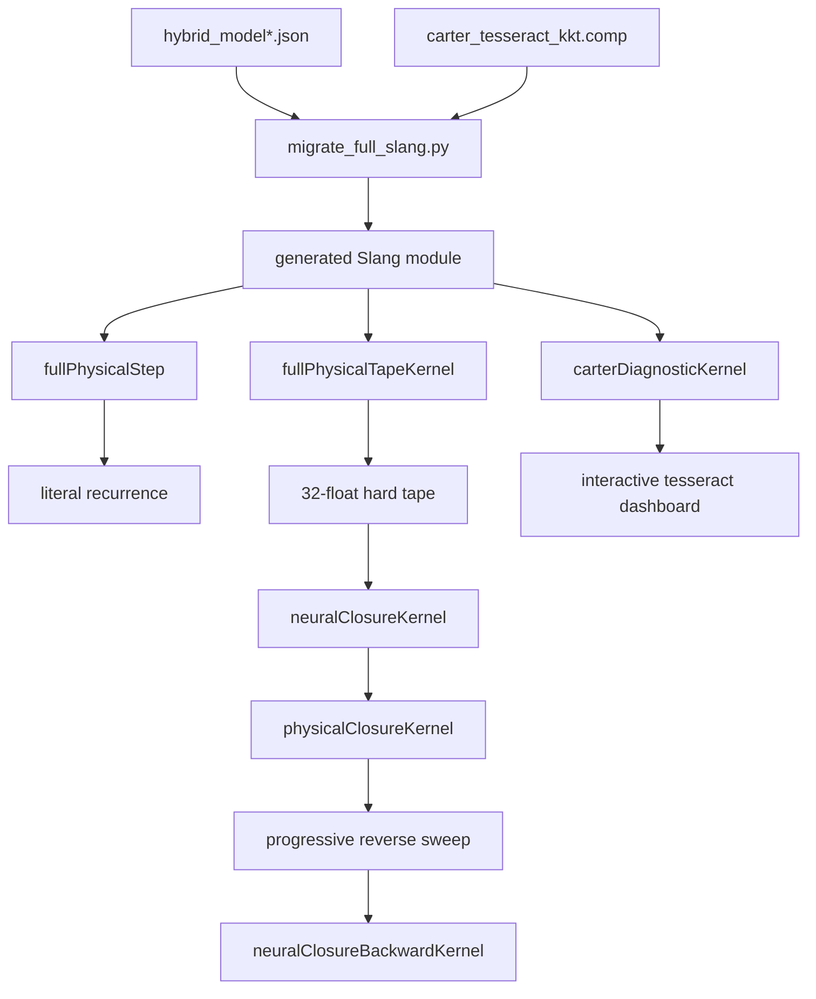

# Architecture

## Source-of-truth layers

The project intentionally has four complementary representations:

| Layer | File | Role |
|---|---|---|
| GLSL | `carter_tesseract_kkt.comp` | Canonical physical equations and headless compute shader |
| PyTorch | `hybrid_tesseract.py` | High-precision differentiable reference and training model |
| Physical PyTorch | `theory33_hybrid.py` | Timelike two-current M1 closure and characteristic audit |
| Physical Slang | `theory33_hybrid.slang` | Analytic M1 constitutive and native reverse kernel |
| Slang | `carter_tesseract_*.slang` | Generated native Vulkan forward and reverse kernels |
| NR CPU | `tesseract_nr/` | Coupled CCZ4, conservative matter, two-current, and mixed-vector PDE oracle |

`migrate_full_slang.py` mechanically imports the GLSL body, specializes model
constants from a portable JSON artifact, and appends the differentiable and
diagnostic kernels. Generated Slang files are tracked so a reader can inspect
the exact shader used in reported experiments.

## Runtime dataflow

## Main shader kernels

### `fullPhysicalStep`

Evaluates the complete recurrence:

- primitive Carter fields;
- invariants;
- both KKT branches;
- neural master function;
- Carter momenta and stress;
- free energy and branchwise derivative;
- boundary certificate;
- literal next state.

### `fullPhysicalTapeKernel`

Records the hard and continuous data needed by a branchwise backward pass.
The 32 columns contain:

| Columns | Meaning |
|---:|---|
| `0` | boundary-crossing indicator \(\iota\) |
| `1` | selected branch \(\sigma\) |
| `2..9` | active \(q,\theta\) values and \(z\)-tangents |
| `10..17` | opposite-side values and tangents |
| `18` | active KKT mask |
| `19` | active classifier mask |
| `20` | active KKT validity |
| `21` | opposite KKT mask |
| `22` | opposite KKT validity |
| `23..24` | active/opposite KKT feasibility margins |
| `25..26` | active/opposite classifier margins |
| `27..28` | active/opposite condition estimates |
| `29` | opposite classifier mask |
| `30` | parity cell |
| `31` | distance to the nearest parity boundary |

### `neuralClosureKernel`

Evaluates both branch copies of the learned master response and writes eight
dual-valued closure components per branch.

### `physicalClosureKernel`

Consumes a frozen hard tape and continuous learned closure, then evaluates the
compact Carter recurrence.

### `neuralClosureBackwardKernel`

Implements a manually lowered mixed-direction jet VJP for all 1,287 shared
weights. It avoids a prohibitively slow higher-order reverse generated by the
current Slang SPIR-V backend.

### `carterDiagnosticKernel`

Exposes all 16 tesseract vertices for visualization. Each vertex reports:

1. scalar value;
2. scalar \(z\)-tangent;
3. vector norm;
4. matrix norm.

## Python components

- `run_tesseract.py` compiles and dispatches the canonical GLSL shader.
- `hybrid_tesseract.py` defines the neural master, exact candidate search,
  custom KKT VJP, Carter closure, recurrence, and rollout.
- `theory33_hybrid.py` reuses the hard recurrence around a self-contained
  physical current map, analytic M1 master, Hilbert stress, convexity gates,
  differentiated principal-symbol audit, and a fitted state-dependent
  odd-cell capture gain for the qualified compact initialization basin. A
  separate hard outer projection maps every finite scalar input into that
  basin before physical evaluation.
- `theory33_hybrid.slang` independently evaluates the analytic M1
  constitutive coefficients and exposes native reverse mode with respect to
  the four physical master features.
- `train_hybrid.py` is the initial short-horizon BPTT experiment.
- `train_lyapunov_conditioned.py` is the scale-1 conditioning curriculum.
- `progressive_full_unroll.py` runs hard-tape BPTT and finite-difference
  validation on Vulkan.
- `visualize_tesseract.py` performs batched Vulkan atlas capture and renders
  the interactive instrument.

## Model artifacts

`hybrid_model.json` is the original learned model. It reproduces the
three-step explosive trajectory and step-four KKT failure at literal scale.

`hybrid_model_conditioned.json` is the separately trained scale-1 model. It
also contains the final 128-step audit metrics.

Binary PyTorch checkpoints are local build artifacts. They are excluded from
Git because the portable JSON contains the inference parameters required by
the shaders.
